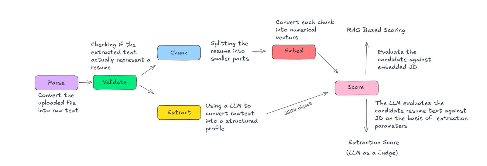

# Resume Screener

An AI-powered resume screening tool that parses resumes, extracts structured data, and scores candidates against job descriptions using LLMs and semantic search.

---

##  Live Demo & Documentation

- **Demo Video**: https://www.loom.com/share/ebcb612f26bb40749b68f20aeb0db4e2  
- **System Architecture & Design Docs**: https://docs.google.com/document/d/1daEb63q6vP3qx_mG2dwBYgjFdbZ-8CwP3CHwljhjC98/edit?usp=sharing  

---

## Pipeline of the project



---

## Features

- **Multi-format parsing** — PDF and DOCX resumes
- **Configurable fields** — Choose which fields to extract via the UI or `config.json`
- **LLM extraction** — Extracts the fields mentioned in the Congif Tab (UI) or config.json 
- **Dual scoring** — Each resume is scored twice:
  - *Extraction-based*: structured profile of the Config-mentioned fields from the resume vs. JD requirements
  - *RAG-based*: semantic evidence from resume sections matched against the JD
- **Seniority-aware scoring** — Hard caps applied when experience level mismatches the role (e.g., fresher applying for a senior role)
- **Multi-role ranking** — Score one resume against multiple JDs at once
- **Batch processing** — Upload many resumes and screen them all in one shot
- **Duplicate detection** — SHA-256 hashing prevents re-processing the same resume for the same role
- **Re-parse support** — Clear the duplicate registry from Config UI after changing extraction fields

---


---

## Setup

### 1. Clone the repo

```bash
git clone <repo-url>
cd resume-screener
```

### 2. Backend

```bash
cd backend
python -m venv venv
source venv/bin/activate        # Windows: venv\Scripts\activate
pip install -r requirements.txt

# Copy and fill in environment variables
cp .env.example .env
# Required:  GROQ_API_KEY   — get a free key at https://console.groq.com
# Optional:  PORT           — backend port (default 8000)
# Optional:  ALLOWED_ORIGINS — comma-separated frontend URLs for CORS

# Start the server
uvicorn main:app --reload
# Or: python main.py   (respects PORT from .env)
# Runs at http://localhost:8000
```

### 3. Frontend

```bash
cd frontend
cp .env.example .env.local
# Set NEXT_PUBLIC_API_URL=http://localhost:8000  (or your deployed backend URL)

npm install
npm run dev
# Runs at http://localhost:3000
```

Open [http://localhost:3000](http://localhost:3000) in your browser.

---

## Usage

### Screen tab
1. Upload a `.pdf` or `.docx` resume
2. Add one or more job descriptions (role name + JD text)
3. Click **Run Screening** — scores and justifications appear below

### Batch tab
1. Upload multiple resumes
2. Add JDs
3. Click **Screen N Resume(s)** — results are ranked by score

### Config tab
- Toggle which fields the LLM extracts (name, skills, experience, etc.)
- Add custom fields
- After changing config, click **Clear Duplicate Registry** so existing resumes can be re-uploaded and re-extracted with the new fields

---

## API Reference

| Method | Endpoint | Description |
|--------|----------|-------------|
| POST | `/screen` | Screen a single resume |
| POST | `/batch` | Screen multiple resumes |
| GET | `/config` | Get current extraction fields |
| PUT | `/config` | Update extraction fields |
| DELETE | `/duplicates` | Clear all duplicate registries |
| DELETE | `/duplicates/{role_id}` | Clear registry for one role |
| GET | `/health` | Health check |

### POST /screen

```
Content-Type: multipart/form-data

resume:     <file>          # .pdf or .docx
jd_entries: <JSON string>   # [{role_name, jd_text}, ...]
force:      false           # set true to re-process a duplicate
```

---

## Scoring Logic

Each resume is scored on a **1–10 scale** per JD, twice:

| Score type | Signal source | What it measures |
|---|---|---|
| Extraction score | Structured fields (skills, YOE, title) | Profile fit vs. JD requirements |
| RAG score | Top-3 semantically relevant resume sections | Evidence-based fit |

**Seniority caps** prevent over-scoring mismatched candidates:
- Fresher (0–1 yr) vs Senior role → max score 4
- Fresher vs Mid role → max score 6

---

## Environment Variables

### Backend (`backend/.env`)

| Variable | Required | Default | Description |
|---|---|---|---|
| `GROQ_API_KEY` | Yes | — | Groq API key ([get one free](https://console.groq.com)) |
| `PORT` | No | `8000` | Port the FastAPI server listens on |
| `ALLOWED_ORIGINS` | No | `http://localhost:3000,...` | Comma-separated list of frontend URLs allowed by CORS |

### Frontend (`frontend/.env.local`)

| Variable | Required | Default | Description |
|---|---|---|---|
| `NEXT_PUBLIC_API_URL` | Yes | — | URL of the FastAPI backend (e.g. `http://localhost:8000`) |

---

## Configuration

`backend/config.json` stores which fields to extract. Default:

```json
{
  "extract_fields": [
    "name", "email", "phone", "years_of_experience",
    "primary_skills", "last_job_title", "education",
    "internships", "projects", "achievements",
    "authentication_experience", "ci_cd_tools"
  ]
}
```

You can also manage this in the **Config** tab of the UI.

---

### Final Words 

This assignment is developed as part of Sprint Hiring Process. Greatful for this opportunity.
